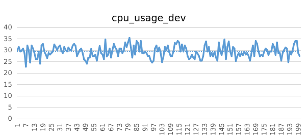
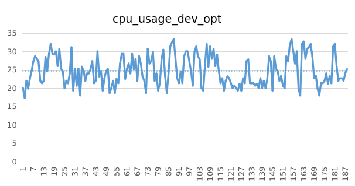

# 7 How to port your app from rs_driver v1.3.x to v1.5.x


## 7.1 Branches and Versions

Now `rs_driver` have the following braches.
+ `dev`. The development branch of `v1.3.x`. The latest version is `v1.3.2`. It is no longer developed.
+ `dev_opt`. The development branch of `v1.5.x`. It is refactoried from `v1.3.x`.
+ `main`. stable branch. It tracked `dev` before, and tracked `dev_opt` now.  

Generally, the modifications in `dev_opt` will be merged into `main` monthly. At the same time, a new version is created.

Occasionally, to solve a emegency problem, hotfix patches will be commited and merged into `dev_opt` and `main`.


## 7.2 What enhancement ?

The main advantage of `v1.5.x` is to reduce CPU usage obviously. 

On a platfrom, CPU usage of `dev` is as below.


CPU usage of `dev_opt` is as below.



Other advantages are as below.

+ Remove the dependency on the Boost library, help to port `rs_driver` to embedded Linux.
+ Add compile options to solve packet-loss problems on some platforms.
+ Refactory `Input` and `Decoder`, to support different use cases.
+ For mechanical LiDARs, use Block as splitting unit instead of Packet, to avoid flash of point cloud .
+ Improve the help documents, including [understand source code of rs_driver](../src_intro/rs_driver_intro_CN.md), to help user understand it.


## 7.3 How to port ?

The interface of rs_driver contains two parts: RSDriverParam and LidarDriver.

### 7.3.1 RSDriverParam

#### 7.3.1.1 RSDriverParam

RSDriverParam contains the options to change the rs_driver's behavior.

RSDriverParam is as below in rs_driver `1.3.x`.

```c++
typedef struct RSDriverParam
{
  RSInputParam input_param;                ///< Input parameter
  RSDecoderParam decoder_param;            ///< Decoder parameter
  std::string angle_path = "null";         ///< Path of angle calibration files(angle.csv).Only used for internal debugging.
  std::string frame_id = "rslidar";        ///< The frame id of LiDAR message
  LidarType lidar_type = LidarType::RS16;  ///< Lidar type
  bool wait_for_difop = true;              ///< true: start sending point cloud until receive difop packet
  bool saved_by_rows = false;              ///< true: the output point cloud will be saved by rows (default is saved by columns)
};
```

And it is as below in rs_driver `1.5.x`.

```c++
typedef struct RSDriverParam
{
  LidarType lidar_type = LidarType::RS16;  ///< Lidar type
  InputType input_type = InputType::ONLINE_LIDAR; ///< Input type
  RSInputParam input_param;                ///< Input parameter
  RSDecoderParam decoder_param;            ///< Decoder parameter
};
```

Below are the changes.
+ A new member `input_type` is added. It means the type of data sources: 
  + `ONLINE_LIDAR`
  +  `PCAP_FILE` 
  + `RAW_PACKET`. User's data captured via `rs_driver`. In `v1.3.x`, a group of functions are for it, and  in `v1.5.x`, it is uniformed to `input_type`.

+ The member `wait_for_difop` specifies whether to handle MSOP packets before handling DIFOP packet. For mechenical LiDARs, the point cloud will be flat without the angle data in DIFOP packet。This option is about decoding, so it is shifted to RSDecoderParam.
+ The member `saved_by_rows` specifies to give point cloud row by row. There are two reasons to remove it: 
  + Even point cloud is given column by column, it is easier to access row by row (by skipping column). 
  + The option consumes two much CPU resources, so not suggested.
  + As a exception on ROS,  `rslidar_sdk` can give point cloud row by row with the option `ros_send_by_rows=true`. This is done while copying point cloud, so as not to cost more efforts.
+ The member `angle_path` specifies a file which contains the angle data. It is about data source, so it is shifted to RSInputParam.
+ The member `frame_id` is a concept from ROS. It is removed, and the driver `rslidar_sdk`  (for ROS) will handle it.

#### 7.3.1.2 RSInputParam

RSInputParam is as below in rs_driver `1.3.x`.

```c++
typedef struct RSInputParam  ///< The LiDAR input parameter
{
  std::string device_ip = "192.168.1.200";     ///< Ip of LiDAR
  std::string multi_cast_address = "0.0.0.0";  ///< Address of multicast
  std::string host_address = "0.0.0.0";        ///< Address of host
  uint16_t msop_port = 6699;                   ///< Msop packet port number
  uint16_t difop_port = 7788;                  ///< Difop packet port number
  bool read_pcap = false;          ///< true: The driver will process the pcap through pcap_path. false: The driver will
                                   ///< Get data from online LiDAR
  double pcap_rate = 1;            ///< Rate to read the pcap file
  bool pcap_repeat = true;         ///< true: The pcap bag will repeat play
  std::string pcap_path = "null";  ///< Absolute path of pcap file
  bool use_vlan = false;           ///< Vlan on-off
  bool use_someip = false;         ///< Someip on-off
  bool use_custom_proto = false;   ///< Customer Protocol on-off
}；
```

And it is as below in rs_driver `1.5.x`.

```c++
typedef struct RSInputParam  ///< The LiDAR input parameter
{
  uint16_t msop_port = 6699;                   ///< Msop packet port number
  uint16_t difop_port = 7788;                  ///< Difop packet port number
  std::string host_address = "0.0.0.0";        ///< Address of host
  std::string group_address = "0.0.0.0";       ///< Address of multicast group
  std::string pcap_path = "";                  ///< Absolute path of pcap file
  bool pcap_repeat = true;                     ///< true: The pcap bag will repeat play
  float pcap_rate = 1.0f;                      ///< Rate to read the pcap file
  bool use_vlan = false;                       ///< Vlan on-off
  uint16_t user_layer_bytes = 0;    ///< Bytes of user layer. thers is no user layer if it is 0
  uint16_t tail_layer_bytes = 0;    ///< Bytes of tail layer. thers is no tail layer if it is 0
};
```

Below are the changes.
+ The member `device_ip` is not needed for receiving packets, so it is removed.
+ The member `multi_cast_address` is renamed to `group_address`。This is to say, in the multicast mode, the host will join the group to receive packets.
+ The member `read_pcap` is not needed now. `RSDriverParam.input_type` replaces it. 
+ The members `use_someip` and `use_custom_proto` is not needed now. `user_layer_bytes` replaces them.

#### 7.3.1.3 RSDecoderParam

RSDecoderParam is as below in rs_driver 1.3.x.

```c++
typedef struct RSDecoderParam  ///< LiDAR decoder parameter
{
  float max_distance = 200.0f;                                       ///< Max distance of point cloud range
  float min_distance = 0.2f;                                         ///< Minimum distance of point cloud range
  float start_angle = 0.0f;                                          ///< Start angle of point cloud
  float end_angle = 360.0f;                                          ///< End angle of point cloud
  SplitFrameMode split_frame_mode = SplitFrameMode::SPLIT_BY_ANGLE;  ///< 1: Split frames by cut_angle;
                                                                     ///< 2: Split frames by fixed number of packets;
                                                             ///< 3: Split frames by custom number of packets (num_pkts_split)
  uint32_t num_pkts_split = 1;         ///< Number of packets in one frame, only be used when split_frame_mode=3
  float cut_angle = 0.0f;              ///< Cut angle(degree) used to split frame, only be used when split_frame_mode=1
  bool use_lidar_clock = false;        ///< true: use LiDAR clock as timestamp; false: use system clock as timestamp
  RSTransformParam transform_param;    ///< Used to transform points
  RSCameraTriggerParam trigger_param;  ///< Used to trigger camera
};
```

And it is as below in rs_driver 1.5.x.

```c++
typedef struct RSDecoderParam  ///< LiDAR decoder parameter
{
  bool config_from_file = false; ///< Internal use only for debugging
  std::string angle_path = "";   ///< Internal use only for debugging
  bool wait_for_difop = true;    ///< true: start sending point cloud until receive difop packet
  float min_distance = 0.2f;     ///< Minimum distance of point cloud range
  float max_distance = 200.0f;   ///< Max distance of point cloud range
  float start_angle = 0.0f;      ///< Start angle of point cloud
  float end_angle = 360.0f;      ///< End angle of point cloud
  SplitFrameMode split_frame_mode = SplitFrameMode::SPLIT_BY_ANGLE;  
                                 ///< 1: Split frames by split_angle;
                                 ///< 2: Split frames by fixed number of blocks;
                                 ///< 3: Split frames by custom number of blocks (num_blks_split)
  float split_angle = 0.0f;      ///< Split angle(degree) used to split frame, only be used when split_frame_mode=1
  uint16_t num_blks_split = 1;   ///< Number of packets in one frame, only be used when split_frame_mode=3
  bool use_lidar_clock = false;  ///< true: use LiDAR clock as timestamp; false: use system clock as timestamp
  bool dense_points = false;     ///< true: discard NAN points; false: reserve NAN points
  RSTransformParam transform_param; ///< Used to transform points
};
```

Below are the changes.
+ The member `cut_angle` is renamed to `split_angle`, to align to `split_frame_mode`.
+ The member `config_from_file` is added. Only if it is true, the member `angle_path` is valid.
+ The member `num_pkts_split` is renamed to `number_blks_split`. That means to split frames `by blocks (in MSOP packets)` instead of `by MSOP packets`.

### 7.3.2 LidarDriver

LidarDriver contains the functions to run rs_driver.

LidarDriver is as below in rs_driver 1.3.x.

```c++
template <typename PointT>
class LidarDriver
{
public:

  inline void regRecvCallback(const std::function<void(const PointCloudMsg<PointT>&)>& callback)
  {
    driver_ptr_->regRecvCallback(callback);
  }
  ...
};
```

And it is as below in rs_driver 1.5.x.

```c++
template <typename T_PointCloud>
class LidarDriver
{
public:

 inline void regPointCloudCallback(const std::function<std::shared_ptr<T_PointCloud>(void)>& cb_get_cloud,
      const std::function<void(std::shared_ptr<T_PointCloud>)>& cb_put_cloud)
  {
    driver_ptr_->regPointCloudCallback(cb_get_cloud, cb_put_cloud);
  }
  ...
};
```

Below are the changes.
+ The template parameter is changed from typename `PointT` to typename `T_PointCloud`.
+ The function to get point cloud is now requested to have two callbacks instead of one.
  + `cb_get_cloud` is to get free point cloud instance from caller. `cb_put_cloud` is to return stuffed point cloud to caller.


For details of these two changes, please refer to [Decode online LiDAR](./08_how_to_decode_online_lidar.md) and [Thread Mode and Interface](../intro/03_thread_model.md). 


