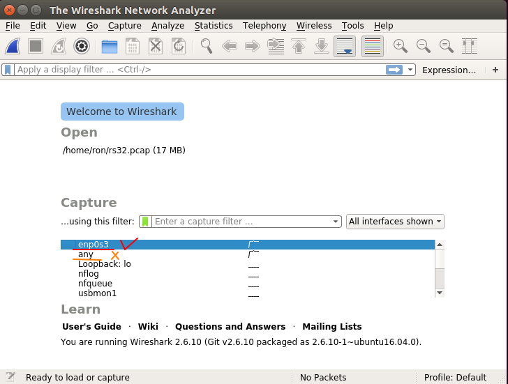
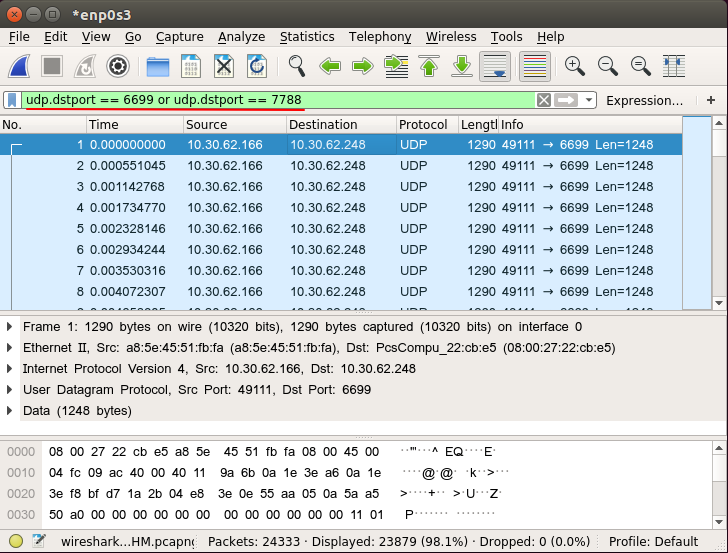
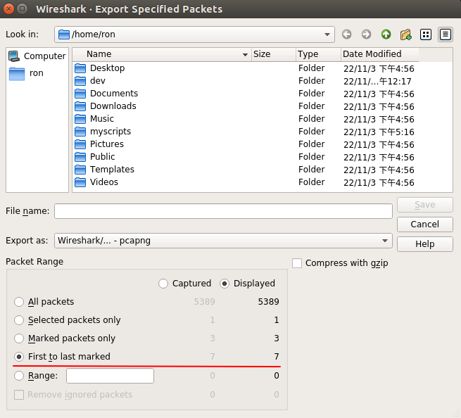

# 13 **Capture PCAP file for `rs_driver`**


## 13.1 Capture with WireShark

### 13.1.1 Choose NIC
First choose a NIC。Here choose `enp0s3`.
+ Don't choose `any`.  If so, the protocol of PCAP file is `linux cooked capture`. rs_driver doesn't accept it.
+ If the LiDAR works on `VLAN`, select to capture on physical NIC or virtual NIC.  There is VLAN layer in former case, and there is no VLAN in latter case.



Use the following network tools to find out the NIC name.

+ `ipconfig` -  on Windows
+ `ifconfig` - on Linux


### 13.1.2 Capture

Now capture packets.


### 13.1.3 Export PCAP files

#### 13.1.3.1 filter out non-MSOP/DIFOP packets

You may exclude non-MSOP/DIFOP packets with filter criteria.

+ Filter criteria with ports `6699` and `7788`.



#### 13.1.3.2 Export All

Select Menu `File` -> `Export Specified Packets ...` to get this dialog.


Export all packets. In above picture, select `All Packets` under `Packet Range`, to export all packets.

+ Select `pcap` format instead of `pcapng`. `rs_driver` doesn't support the latter.
+ Under `Packet Range`, there are two columns: `Captured` and `Displayed`. Keep `Displayed` here.
  + `Captured` are all captured packets. `Displayed` are the filtered. For example,  in the line of `All packets`, captures `24333`, and leaves `23879` after filtering.
  + If `Captured` export packets from all captured packets, else export only the filtered.

#### 13.1.3.3 Export a Range of packets

Here export a range of packets.

+ This example give a range `1`-`10000`. These two numbers are from all packets. Actually `9805` packets are exported.


#### 13.1.3.4 Mark and Export

Here mark a few packets and export them. First mark the packets with Menu  `Mark/Unmark Packet`.


Select `Marked packets only`.


#### 13.1.3.5 Mark and Export A Range

Here mark two packets, and export all packet between them. Select `First to last marked`.



## 13.2 Capture with tcpdump

`tcpdump`  is the a tool on Unix/Linux.

As below, capture packets on NIC `eno1` and save them into `a.pcap`, with filter criteria `UDP` and destination port `6699` or `7788`. And capture `30000` packets. 

```shell
sudo tcpdump -i eno1 -w a.pcap -c 30000 'udp dst port 7788 or 6699'
```

Use `ifconfig` to find out the NIC name.

Don't use the option`-i any`. It captures on  NIC `any` , and the protocol is `linux cooked capture`. This is not the Ethernet protocol. rs_driver doesn't accept it.

```shell
sudo tcpdump -i any
```

