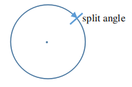

# 19 **分帧策略**


## 19.1  概述

本文分别说明机械式雷达和MEMS的分帧策略。因为工作原理不同，所以它们的分帧策略也不同。

本文引用了如下一些文档的概念，请阅读。

[如何解决丢包问题](./17_how_to_avoid_packet_loss_CN.md)

[点在点云中的布局](./18_about_point_layout_CN.md)


## 19.2  机械式雷达

机械式雷达绕轴持续`360`°旋转扫描，并输出点，`rs_driver`按指定角度分割这些点，每一次分割得到一圈点云，也就是一帧。

这个分帧角度的默认值为`0`°。`rs_driver`的使用者，可以通过配置选项`RSDecoderParam.split_angle`指定这个角度。


每一轮扫描得到一组点，每个通道一个点，打包到一个`Block`，写入MSOP Packet中。`Block`保存这一组点的水平角。

所谓分帧，就是检查这个水平角是不是跨过了分帧角度，如果跨过了，这一组点就属于下一帧，而之前的点就可以打包到上一帧了。

### 19.2.1 分帧的水平角误差

`Block`的水平角是它第一个点的时间戳。由于雷达一直在转，后面点的水平角还要在这个基础上加上一个偏移值。这样它们就可能跨过分帧角度，进而导致点云在分帧角度附近重复点或遗漏点。

这里对`Block`跨过的水平角度估算一下，看看影响有多大。

如果转速为`600`圈/分钟，那么每圈的时间为：

```c++
1 / (600 / 60) = 0.1 (秒) 
```

机械式雷达每轮扫描之间的时间差一般是`50`~`60`微秒。以RS16为例，它的扫描间隔为`55.5`微秒。那么一圈的扫描轮数是：

```c++
 0.1 * 1000000 / 55.5 = 1801.8 (次)
```

`Block`的水平角跨度为：

```c++
360 / 1801.8 = 0.1998 (度)
```

这就是说，分帧角度附近重复或遗漏点的最大水平角跨度大约是`0.2`度。

### 19.2.2 分帧的时间误差

机械式雷达每轮扫描之间的时间差一般是`50`~`60`微秒。这也就是分帧的时间误差。

### 19.2.3 每帧的点数是波动的

以RS16为例。在`600`圈/分钟的情况下，一圈扫描`1801.8`次，取整`1802`次，那就有

```c++
16 * 1802 = 28832 (点）
```

但是雷达马达的旋转并不是这么匀速。转得快一点，每圈就少扫描几轮，慢一点，每圈就多扫描几轮。

因为每轮扫描的点数是雷达的线数，所以少/多的点数是雷达线数的整数倍。对于RS16，就是`16`的整数倍。

### 19.2.4 丢包与乱序处理

机械式雷达均匀发送MSOP Packet，每次发送一个Packet，两个Packet的时间间隔较大，所以暂时没有发现丢包与乱序需要处理。


## 19.3 MEMS雷达

MEMS雷达的分帧，本质上在雷达端就确定了。

雷达有`5`个扫描区域，每轮扫秒同时扫描这`5`个区域，得到`5`个点，打包到一个`Block`，写入MSOP Packet。

在每个区域，按照Z字型进行扫描。这样一直继续，直到完成全部区域，得到一组MSOP Packet。

这组Packet按扫描顺序从1开始编号。以M1雷达为例，编号为`1`~`630`。

最后`rs_driver`做的，是按照这些编号分割MSOP Packet。

### 19.3.1 丢包与乱序处理

MEMS雷达可能同时发送多个MSOP Packet，这样丢包和乱序的风险就变大了。

主机端的丢包，可以通过增大Socket接收缓存解决，但是从雷达到主机之间的丢包、乱序还是可能存在。

`rs_driver`引入`安全区间`的做法，来处理可能的丢包和乱序。


先讨论没有`安全区间`时，如何处理丢包、乱序。

+ 理想情况下，如果不丢包不乱序，MSOP Packet编号从`1`到`630`, 只需要检查Packet编号是不是`1`。如果是就分帧。
+ 那假如只有丢包呢？举个例子，如果编号为`1`的Packet丢了，则可以加入检查条件，就是当前Packet编号小于前一个Packet的编号`prev_seq`，就分帧。
+ 在乱序的情况下，这个检查条件会导致另一个困境。举个例子，如果编号为`300`和`301`的两个Packet乱序，那么这个位置分帧，会导致原本的一帧拆分成两帧。


`安全区间`的做法如下：

+ 以`prev_seq`为参考点，划定一个范围值`RANGE`, 

```c++
safe_seq_min = prev_seq_ - RANGE
safe_seq_max = prev_seq_ + RANGE
```

+ 如果MSOP Packet在范围(`safe_seq_min_`, `safe_seq_max_`)内，不算异常，不分帧。


这样轻微的乱序不会触发分帧，也就解决了前面说的困境。


