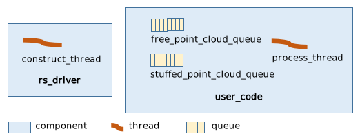

# 3 Thread Model

## 3.1 Overview

This document is to describe the `rs_driver`'s API. 

However, it seems to be useful and necessary to describe its components first. Why?
+ the caller implemented callbacks are running in `rs_driver`'s threads. They may block the threads with bad design.
+ Caller is supposed to manage the point cloud queue, to avoid copy of point cloud, and repeat allocation and release. This is just how `rs_driver` manages the MSOP/DIFOP packet queue.

## 3.2 Components and Threads

`rs_driver` consists of three parts: `Input`, `Decoder`, and `LidarDriverImpl`.

+ `Input` gets MSOP/DIFOP packets from network sockets, PCAP file, etc. Its implementation classes have their own threads `recv_thread`.
+ `Decoder` parses MSOP/DIFOP packets and constructs point cloud. `Decoder` has no threads. It runs in `LidarDriverImpl`'s MSOP/DIFOP packet handling threads `handle_thread`.
+ `LidarDriverImpl` combines `Input` and `Decoder`. It gets MSOP/DIFOP packets and dispatches them to `Decoder` by their type. After getting point cloud from `Decoder`, `LidarDriverImpl` returns it to caller via the callback function.

There are two details here.

+ `LidarDriverImpl` manages a free MSOP/DIFOP packet queue `free_pkt_queue`, and a stuffed packet queue `pkt_queue`. Input first get free packet instance, stuffs it, and return it to `pkt_queue`. This is done with `LidarDriverImpl`'s callbacks. 
+ `LidarDriverImpl`'s callbacks runs in Input's thread `recv_thread`. They fetch packet instance from queue, and return it to queue. This is simple work and will not block `recv_thread`.

Apply this design to point cloud queue.

+ Caller manage point cloud instances. `rs_driver` requests two callbacks. One is to get free point cloud, and the other is to return stuffed point cloud. Caller is encouraged to adopt the design of packet queue.
+ Caller's callbacks runs in `rs_driver`'s thread `handle_thread`. It parses MSOP/DIFOP packets. If it is slow, the packet queue will overflow. `rs_driver` then reports `ERRCODE_PKTBUFOVERFLOW` and discards packets. To avoid this, caller should NOT do any time-consuming task in the callbacks.

## 3.3 Interface

Now rs_driver's design objectives is clear.

+ Avoid to copy point cloud, and avoid to malloc/free point cloud repeatedly.
+ Parallel the construction and the process of point cloud.

Below is the supposed interaction between rs_driver and user's code. Most detail of `rs_driver` is omitted except the thread `handle_thread`. And it is renamed as `construct_thread` since we are focusing on point cloud. 

`rs_driver` runs in its thread `construct_thread`. It

+ Gets free point cloud from user. User fetches it from a free cloud queue `free_point_cloud_queue`. If the queue is empty, then create a new one.
+ Parses packets and constructs point cloud.
+ Returns stuffed point cloud to user.
+ User's code is supposed to shift it to the queue `stuffed_point_cloud_queue`.

User's code runs in its thread `process_thread`. It
+ Fetches stuffed point cloud from the queue `stuffed_point_cloud_queue`
+ Process the point cloud
+ Return the point cloud back to the queue `free_point_cloud_queue`. rs_driver will use it again.

